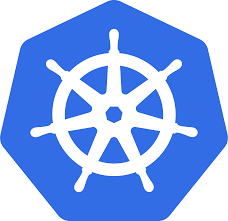

# Kubernetos Introduction



## Microk8s
* microk8s is Kubernetes, installed locally! microk8s is designed to be a fast and lightweight upstream Kubernetes install isolated from your host but not via a virtual machine. This isolation is achieved by packaging all the upstream binaries for Kubernetes, Docker.io, iptables, and CNI in a single appliication container
# Kubernetos Installation
## Master

### Requirements
* 2 GB or more of RAM per machine (any less will leave little room for your apps)
* 2 CPUs or more
* Full network connectivity between all machines in the cluster (public or private network is fine)
* Unique hostname, MAC address, and product_uuid for every node. See here for more details.
* Certain ports are open on your machines. See here for more details.
* Swap disabled. You MUST disable swap in order for the kubelet to work properly.

* Initially we need to install docker

* then we need to install kubectl,kubeadm,kubelet

installing kubeadm, kubelet and kubectl
You will install these packages on all of your machines:

### kubeadm
* the command to bootstrap the cluster.

### kubelet
* the component that runs on all of the machines in your cluster and does things like starting pods and containers.

### kubectl
* the command line util to talk to your cluster.

*kubeadm will not install or manage kubelet or kubectl for you, so you will need to ensure they match the version of the Kubernetes control plane you want kubeadm to install for you. If you do not, there is a risk of a version skew occurring that can lead to unexpected, buggy behaviour. However, one minor version skew between the kubelet and the control plane is supported, but the kubelet version may never exceed the API server version. For example, kubelets running 1.7.0 should be fully compatible with a 1.8.0 API server, but not vice versa.

For information about installing kubectl, see Install and set up kubectl.

Warning: These instructions exclude all Kubernetes packages from any system upgrades. This is because kubeadm and Kubernetes require special attention to upgrade.
For more information on version skews, see:

Kubernetes version and version-skew policy
Kubeadm-specific version skew policy
Ubuntu, Debian or HypriotOSCentOS, RHEL or FedoraContainer Linux
```
apt-get update && apt-get install -y apt-transport-https curl
curl -s https://packages.cloud.google.com/apt/doc/apt-key.gpg | apt-key add -
cat <<EOF >/etc/apt/sources.list.d/kubernetes.list
deb https://apt.kubernetes.io/ kubernetes-xenial main
EOF
apt-get update
apt-get install -y kubelet kubeadm kubectl
apt-mark hold kubelet kubeadm kubectl
```
The kubelet is now restarting every few seconds, as it waits in a crashloop for kubeadm to tell it what to do.

### Pod Network
For flannel to work correctly, you must pass --pod-network-cidr=10.244.0.0/16 to kubeadm init.

Set /proc/sys/net/bridge/bridge-nf-call-iptables to 1 by running sysctl net.bridge.bridge-nf-call-iptables=1 to pass bridged IPv4 traffic to iptables’ chains. This is a requirement for some CNI plugins to work, for more information please see here.

Make sure that your firewall rules allow UDP ports 8285 and 8472 traffic for all hosts participating in the overlay network. see here .

Note that flannel works on amd64, arm, arm64, ppc64le and s390x under Linux. Windows (amd64) is claimed as supported in v0.11.0 but the usage is undocumented.
```
kubectl apply -f https://raw.githubusercontent.com/coreos/flannel/62e44c867a2846fefb68bd5f178daf4da3095ccb/Documentation/kube-flannel.yml

```
#### After kubeinit command
* To make kubectl work for your non-root user, run these commands, which are also part of the kubeadm init output:
```
mkdir -p $HOME/.kube
sudo cp -i /etc/kubernetes/admin.conf $HOME/.kube/config
sudo chown $(id -u):$(id -g) $HOME/.kube/config
```

* copy the command after kubeinit command and run that command in node
```
kubeadm join 192.168.0.6:6443 --token 6fzf36.gzg88fqhw7yqw3ge \
    --discovery-token-ca-cert-hash sha256:33e45134d1eab2dd5862409da64c492b15065da00cb7da5b6a46a78cb36b990f
```

## NODE set up

* Install docker,kubectl,kubeadmi,kubelet

* execute that command 