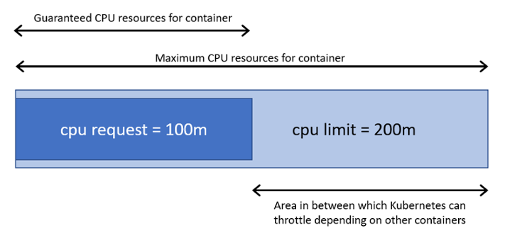

# Creating users
Command to create users in k8s

```
 openssl genrsa -out developer.key 2048
```
creating csr(certificate req for developer)
```
openssl req -new -key developer.key -out developer.csr -subj "/CN=developer/O=ventech"
```
Sign the certificate by cluster for this you need to find the location of kubeernetes where its keeps the all the certificates of its cluster
# Changing the default StorageClass
List the StorageClasses in your cluster:
```
kubectl get storageclass
```
The output is similar to this:

NAME                 PROVISIONER               AGE
standard (default)   kubernetes.io/gce-pd      1d
gold                 kubernetes.io/gce-pd      1d
The default StorageClass is marked by (default).

Mark the default StorageClass as non-default:

The default StorageClass has an annotation storageclass.kubernetes.io/is-default-class set to true. Any other value or absence of the annotation is interpreted as false.

To mark a StorageClass as non-default, you need to change its value to false:
```
  kubectl patch storageclass <your-class-name> -p '{"metadata": {"annotations":
  {"storageclass.kubernetes.io/is-default-class":"false"}}}'
```
where <your-class-name> is the name of your chosen StorageClass.

Mark a StorageClass as default:

Similarly to the previous step, you need to add/set the annotation storageclass.kubernetes.io/is-default-class=true.

``` 
kubectl patch storageclass <your-class-name> -p '{"metadata": {"annotations":{"storageclass.kubernetes.io/is-default-class":"true"}}}'
```
Please note that at most one StorageClass can be marked as default. If two or more of them are marked as default, a PersistentVolumeClaim without storageClassName explicitly specified cannot be created.

Verify that your chosen StorageClass is default:
```
  kubectl get storageclass
```
The output is similar to this:

  NAME             PROVISIONER               AGE
  standard         kubernetes.io/gce-pd      1d
  gold (default)   kubernetes.io/gce-pd      1d
# Horizontal Pod AutoScaling 

* For Pod autoscalling We need to collect metrics From pods.For that we need to install Metric server or Heapstar in our cluster.
* Then we'll get metrics from pods and nodes by following commands.
```
kubectl top pods
kubectl top nodes
```
* In our deployment Manifest file we need to mention resources and requests
## What is resource and Requests?
* Setting container resource constraints
Within the pod configuration file cpu and memory are each a resource type for which constraints can be set at the container level. A resource type has a base unit. CPU is specified in units of cores, and memory is specified in units of bytes. Two types of constraints can be set for each resource type: requests and limits.

* A request is the amount of that resources that the system will guarantee for the container, and Kubernetes will use this value to decide on which node to place the pod. A limit is the maximum amount of resources that Kubernetes will allow the container to use. In the case that request is not set for a container, it defaults to limit. If limit is not set, then if defaults to 0 (unbounded). Setting request < limits allows some over-subscription of resources as long as there is spare capacity. This is part of the intelligence built into the Kubernetes scheduler.

```
apiVersion: apps/v1
kind: Deployment
metadata:
  name: tom-deployment
  labels:
    app: tomcat-app 
spec:
  replicas: 3
  selector:
    matchLabels:
      app: tomcat-app
  template:
    metadata:
      labels:
       app: tomcat-app
    spec:
      containers:
      - name: tomcat-cont
        image: tomcat:8.0
        resources:
          requests:
            cpu: 100m
            memory: 128Mi
          limits:
            cpu: 250m
            memory: 256Mi
        ports:
        - containerPort: 8080
```

* Then we create a Service to expose our appilication to out side world.
For example Nodeport
```
apiVersion: v1
kind: Service
metadata:
  name: tom-service
  labels:
    app: tomcat-app
spec:
  selector:
    app: tomcat-app
  type: NodePort
  ports:
  - nodePort: 31001
    port: 8080
    targetPort: 8080
```

* Then we create horizontal deployment file based on metrics

```
apiVersion: autoscaling/v1
kind: HorizontalPodAutoscaler
metadata:
  name: tomcat-autoscale
spec:
  maxReplicas: 7
  minReplicas: 3
  scaleTargetRef:
    apiVersion: extensions/v1beta1
    kind: Deployment
    name: tom-deployment
  targetCPUUtilizationPercentage: 20
```

# Context

A context is a group of access parameters. Each context contains a Kubernetes cluster, a user, and a namespace. The current context is the cluster that is currently the default for kubectl: all kubectl commands run against that cluster.